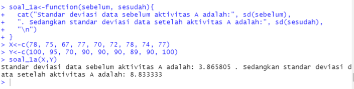
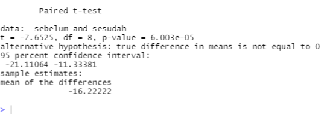

# P2_Probstat_C_5025201222
Florentino Benedictus
5025201222
Probstat C
Praktikum 2
## Inisialisasi
Dalam pengerjaan soal akan memerlukan beberapa library, sehingga pertama kali perlu menginstall dan load library
```r
#Install Packages
install.packages(c("BSDA","ggpubr"))
install.packages(c("readr","ggplot2","multcompView","dplyr","mosaic"))

#Load Libraries
Packages <- c("BSDA","ggpubr","readr","ggplot2","multcompView","dplyr","mosaic")
invisible(lapply(Packages, library, character.only = TRUE))
```
## Soal No. 1
### 1A
Dalam soal ini dapat menggunakan 2 vector yang menyimpan data sebelum dan sesudah aktivitas A lalu menggunakan fungsi bawaan `sd()`
```r
soal_1a<-function(sebelum, sesudah){
  cat("Standar deviasi data sebelum aktivitas A adalah:", sd(sebelum),
  ". Sedangkan standar deviasi data setelah aktivitas A adalah:", sd(sesudah),
  "\n")
}
X<-c(78, 75, 67, 77, 70, 72, 78, 74, 77)
Y<-c(100, 95, 70, 90, 90, 90, 89, 90, 100)
soal_1a(X,Y)
```

### 1B & 1C
Karena dalam soal ini nilai t juga bisa didapatkan dengan menjalankan fungsi 1C, maka akan digabung.<br>
Pada soal ini, karena kedua sampel dependen maka digunakan `paired = TRUE`. Sehingga pada screenshot dapat terlihat nilai t dan p-value yang sudah didapat (1B) dan karena nilai `p-value = 6.003e-05` yang lebih kecil dari α maka H0 dapat ditolak, sehingga kesimpulan **ada
pengaruh yang signifikan secara statistika dalam hal kadar saturasi
oksigen**(1C)
```r
#1B & 1C
soal_1bc<-function(sebelum, sesudah){
  t.test(sebelum, sesudah,
         alternative = "two.sided",
         paired = TRUE, conf.level = 0.95)
}
X<-c(78, 75, 67, 77, 70, 72, 78, 74, 77)
Y<-c(100, 95, 70, 90, 90, 90, 89, 90, 100)
soal_1bc(X,Y)
```


## Soal No. 2
### 2A
Setuju
### 2B
Dari output disimpulkan bahwa tes yang digunakan adalah t-test, karena standar deviasi populasi tidak diketahui. Nilai t didapatkan 8.9744 dengan confidence interval default 95%, ditemukan p-value 9.437e-15.
```r
soal_2b<-function(mean, sd){
  tsum.test(mean, s.x=3900,n.x=100,mu=20000, alternative = "greater")
}
soal_2b(23500, 3900)
```

### 2C
Karena nilai p-value jauh lebih kecil dari alfa maka dapat disimpulkan hipotesis 0 (mean dibawah 20000) dapat ditolak dan hipotesis 1 (klaim mean diatas 20000) mendapat bukti yang cukup

## Soal No. 3

## Soal No. 4

## Soal No. 5

## Soal No. 6
