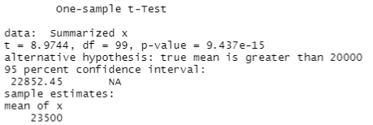
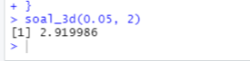

# P2_Probstat_C_5025201222
Florentino Benedictus<br>
5025201222<br>
Probstat C<br>
Praktikum 2<br>

## Inisialisasi
Dalam pengerjaan soal akan memerlukan beberapa library, sehingga pertama kali perlu menginstall dan load library
```r
#Install Packages
install.packages(c("BSDA","ggpubr"))
install.packages(c("readr","ggplot2","multcompView","dplyr","mosaic"))

#Load Libraries
Packages <- c("BSDA","ggpubr","readr","ggplot2","multcompView","dplyr","mosaic")
invisible(lapply(Packages, library, character.only = TRUE))
```
## Soal No. 1
### 1A
Dalam soal ini dapat menggunakan 2 vector yang menyimpan data sebelum dan sesudah aktivitas A lalu menggunakan fungsi bawaan `sd()`
```r
soal_1a<-function(sebelum, sesudah){
  cat("Standar deviasi data sebelum aktivitas A adalah:", sd(sebelum),
  ". Sedangkan standar deviasi data setelah aktivitas A adalah:", sd(sesudah),
  "\n")
}
X<-c(78, 75, 67, 77, 70, 72, 78, 74, 77)
Y<-c(100, 95, 70, 90, 90, 90, 89, 90, 100)
soal_1a(X,Y)
```

### 1B & 1C
Karena dalam soal ini nilai t juga bisa didapatkan dengan menjalankan fungsi 1C, maka akan digabung.<br>
Pada soal ini, karena kedua sampel dependen maka digunakan `paired = TRUE`. Sehingga pada screenshot dapat terlihat nilai t dan p-value yang sudah didapat (1B) dan karena nilai `p-value = 6.003e-05` yang lebih kecil dari α maka H0 dapat ditolak, sehingga kesimpulan **ada
pengaruh yang signifikan secara statistika dalam hal kadar saturasi
oksigen**(1C)
```r
#1B & 1C
soal_1bc<-function(sebelum, sesudah){
  t.test(sebelum, sesudah,
         alternative = "two.sided",
         paired = TRUE, conf.level = 0.95)
}
X<-c(78, 75, 67, 77, 70, 72, 78, 74, 77)
Y<-c(100, 95, 70, 90, 90, 90, 89, 90, 100)
soal_1bc(X,Y)
```


## Soal No. 2
### 2A
| Sebelum dibuktikan | Setuju karena terlihat benar secara kasat mata tetapi masih perlu dibuktikan secara statistik    |
| ------------------ | ------------------------------------------------------------------------------------------------ |
| Setelah dibuktikan | Setelah dibuktikan secara statistik melalui No. 2B & 2C terbukti hipotesis benar sehingga setuju |
### 2B
Dari output disimpulkan bahwa tes yang digunakan adalah t-test, karena standar deviasi populasi tidak diketahui. Nilai t didapatkan 8.9744 dengan confidence interval default 95%, ditemukan p-value 9.437e-15.
```r
soal_2b<-function(mean, sd){
  tsum.test(mean, s.x=3900,n.x=100,mu=20000, alternative = "greater")
}
soal_2b(23500, 3900)
```

### 2C
Karena nilai p-value jauh lebih kecil dari alfa maka dapat disimpulkan hipotesis 0 (mean dibawah 20000) dapat ditolak dan hipotesis 1 (klaim mean diatas 20000) mendapat bukti yang cukup

## Soal No. 3
### 3A
Pada soal terdapat kalimat `apakah ada perbedaan pada rata-ratanya` sehingga dapat disimpulkan bahwa kalimat ini merupakan hipotesa 1<br>
- $H0$ = tidak terdapat perbedaan signifikan antara rata-rata kedua kota<br>
- $H1$ = terdapat perbedaan signifikan antara rata-rata kedua kota
### 3B
Karena H1: $Bandung ≠ Bali$, maka digunakan two-sided
```r
soal_3b<-function(){
  tsum.test(mean.x=3.64, s.x = 1.67, n.x = 19,
            mean.y=2.79, s.y = 1.32, n.y = 27,
            alternative="two.sided", var.equal=TRUE)
}
soal_3b()
```

### 3C
```r
soal_3c<-function(){
  plotDist(dist='t', df=2, col="red")
}
soal_3c()
```

### 3D
df=2 dari soal sebelumnya, sehingga menggunakan t-test dan dapat dihitung dengan `qt()`
```r
soal_3d<-function(p, df){
  qt(p, df, lower.tail=FALSE)
}
soal_3d(0.05, 2)
```

### 3E
Diketahui α = 0.05 dan p-value dari 3B adalah 0.06049. Karena nilai p-value masih lebih besar maka H0 tidak dapat ditolak karena bukti belum cukup
### 3F
Karena yang berlaku H0, maka dapat disimpulkan tidak terdapat perbedaan signifikan antara rata-rata kota Bandung dan Bali

## Soal No. 4
Pertama-tama, ambil data dari [link dataset](https://rstatisticsandresearch.weebly.com/uploads/1/0/2/6/1026585/onewayanova.txt)
```r
dataoneway <- read.table(url("https://rstatisticsandresearch.weebly.com/uploads/1/0/2/6/1026585/onewayanova.txt"),h=T)
attach(dataoneway)
names(dataoneway)
```
### 4A
Pada soal ini akan dilakukan grouping kucing oren, kucing hitam, dan kucing putih. Lalu graph dapat ditampilkan. Terlihat bahwa pada ketiga grup tidak ada outlier utama.
```r
soal_4a<-function(){
  dataoneway$Group <- as.factor(dataoneway$Group)
  dataoneway$Group = factor(dataoneway$Group,labels = c("Kucing Oren", "Kucing Hitam", "Kucing Putih"))
  
  class(dataoneway$Group)
  
  Group1 <- subset(dataoneway, Group == "Kucing Oren")
  Group2 <- subset(dataoneway, Group == "Kucing Hitam")
  Group3 <- subset(dataoneway, Group == "Kucing Putih")
  
  qqnorm(Group1$Length)
  qqline(Group1$Length)
  
  qqnorm(Group2$Length)
  qqline(Group2$Length)
  
  qqnorm(Group3$Length)
  qqline(Group3$Length)
}
soal_4a()
```


### 4B
Didapat p-value dari 4B adalah 0.8054, karena 0.8054>0.05 (confidence interval) maka H0 tidak dapat ditolak karena kurang bukti
```r
soal_4b<-function(){
  bartlett.test(Length ~ Group, data = dataoneway)
}
soal_4b()
```

### 4C
```r
soal_4c<-function(){
  model1 = lm(Length ~ Group, data = dataoneway)
  anova(model1)
}
soal_4c()
```

### 4D
Didapat dari soal 4C p-value = 0.0013, karena 0.0013<0.05 (confidence interval) maka H0 dapat ditolak sehingga terbukti ada perbedaan panjang tetapi belum diketahui kucing mana yang memiliki perbedaan

### 4E
Jika perbandingan spesies memiliki nilai p>0.05, maka secara statistik kedua spesies memiliki panjang yang sama. Sedangkan jika dibawah 0.05, maka spesies berbeda. Terlihat dari hasil pada tabel hasil kucing putih dan kucing oren memiliki panjang sama p=0.8726158. Sedangkan kucing hitam berbeda dari keduanya. Melalui tabel selisih (diff), ditemukan bahwa kucing hitam lebih pendek daripada kucing putih dan oren
```r
soal_4e<-function(){
  TukeyHSD(aov(model1))
}
soal_4e()
```

### 4F
Perbedaan kucing hitam dengan kucing putih & oren terlihat lebih jelas
```r
soal_4f<-function(){
  ggplot(dataoneway, aes(x = Group, y = Length)) +
    geom_boxplot(fill = "grey80", colour = "black") +
    scale_x_discrete() + xlab("Treatment Group") +
    ylab("Length (cm)")
}
soal_4f()
```


## Soal No. 5
Pertama-tama, download `.csv` lalu letakkan `.csv` pada directory `C:\Users\USER\Documents`, lalu read isi `.csv`
```r
GTL <- read_csv("GTL.csv")
head(GTL)

str(GTL)
```
### 5A
```r
soal_5a<-function(){
  qplot(x = Temp, y = Light, geom = "point", data = GTL) +
    facet_grid(.~Glass, labeller = label_both)
}
soal_5a()
```

### 5B
```r
#5B
soal_5b<-function(){
  GTL$Glass <- as.factor(GTL$Glass)
  GTL$Temp_Factor <- as.factor(GTL$Temp)
  str(GTL)
  
  anova <- aov(Light ~ Glass*Temp_Factor, data = GTL)
  summary(anova)
}
soal_5b()
```

### 5C
```r
soal_5c<-function(){
  data_summary <- group_by(GTL, Glass, Temp) %>%
    summarise(mean=mean(Light), sd=sd(Light)) %>%
    arrange(desc(mean))
  print(data_summary)
}
soal_5c()
```

### 5D
```r
soal_5d<-function(){
  tukey <- TukeyHSD(anova)
  print(tukey)
}
soal_5d()
```

### 5E
```r
soal_5e<-function(){
  tukey.cld <- multcompLetters4(anova, tukey)
  print(tukey.cld)
  
  cld <- as.data.frame.list(tukey.cld$`Glass:Temp_Factor`)
  data_summary$Tukey <- cld$Letters
  print(data_summary)
  
  #Opsional: export .csv
  write.csv("GTL_summary.csv")
}
soal_5e()
```

